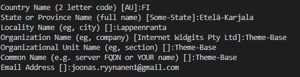

# Developing with SSL locally

## Creating a key and cert file

openssl req -x509 -newkey rsa:4096 -keyout key.pem -out cert.pem -days 365

Put the following values to the questions:

The Node.js server launches the SSL server in development mode only. To start the server in development mode, run

**npm run dev**
